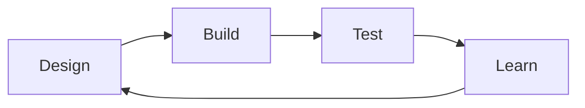

# BASIS-China Wiki 写作说明

Wiki 正文在 Markdown 里。改页面就是改对应的 `.md`：保留文件开头两条 `---` 之间的元数据，改后面的正文，保存后再到网页上看效果。

普通段落、图片、表格看「Markdown」一节。引用、脚注、科研卡片用到再查。

## 第一次怎么改

先看渲染，再改正文。

1. 打开写作预览。导航和页脚都没有入口，只能直接走链接：

```text
https://2026.igem.wiki/basis-china/studio
```

本地开发也可以：

```bash
bun run studio
```

或先 `bun run dev`，再打开：

```text
http://localhost:5173/basis-china/studio
```

2. 用 **Preview as** 选要写的页面，点 **Load this page** 载入现在的正文。
3. 左边改 Markdown，右边就是这页在 wiki 里的实际样子：封面、目录、科研卡片、引用、公式都走同一套管线。
4. 写好后点 **Copy Markdown**（或 `Ctrl/Cmd + S`），粘贴回对应的 `.md` 文件。
5. 这个工具不会改仓库。提交前仍要跑：

```bash
bun run validate:content
```

通过就行。报错对照文末那张表。

想直接对着文件改，也可以打开 `src/content/articles/` 里的 `.md`，保存后刷新对应网页。以 Results 为例，文件是 `src/content/articles/project/results.md`，预览地址一般是：

```text
http://localhost:5173/basis-china/results
```

正文大标题写 `## Results overview`，不要写 `# Results`。文件最上面两条 `---` 之间的元数据不要动结构。

## 哪些文件能改

| 位置                                     | 是什么                     | 能不能改                         |
| ---------------------------------------- | -------------------------- | -------------------------------- |
| `src/content/articles/`                  | Wiki 正文                  | 改这里                           |
| `src/content/references/references.yaml` | 参考文献库                 | 加文献时改                       |
| `src/features/team/teamData.ts`          | Team 页成员资料            | 让开发改                         |
| `src/config/pageData.ts`                 | 页面地址、导航、浏览器标题 | 改页面名或加新页时找开发         |
| `src/content/fixtures/`                  | 系统测试样本               | 不改                             |
| `dist/`                                  | 构建产物                   | 不改，下次构建会覆盖             |

三个例外：

- 首页 `/` 不是 Markdown，改内容和版式找开发。
- Team 页 `/team` 的成员卡片不在 Markdown 里。
- Attributions 页 `/attributions` 读 iGEM 官方表单。贡献记在官方表单里，不要另做一页顶替。

## 页面和文件

路径都省略了前面的 `src/content/`。

| 页面                   | 文件                                      | 写什么                                 |
| ---------------------- | ----------------------------------------- | -------------------------------------- |
| `/description`         | `articles/project/description.md`         | 问题、背景、选题理由、总体方案         |
| `/engineering`         | `articles/project/engineering.md`         | 每轮 Design–Build–Test–Learn 改了什么  |
| `/results`             | `articles/project/results.md`             | 结果、数据、分析、局限                 |
| `/contribution`        | `articles/project/contribution.md`        | 后续团队能接着用的东西                 |
| `/parts`               | `articles/project/parts.md`               | Parts、功能、状态、Registry 链接       |
| `/experiments`         | `articles/wet-lab/experiments.md`         | 实验目的、材料、步骤、对照、安全       |
| `/notebook`            | `articles/wet-lab/notebook.md`            | 按日期记做了什么、得到什么             |
| `/measurement`         | `articles/wet-lab/measurement.md`         | 测量方法、校准、误差、数据处理         |
| `/plant`               | `articles/wet-lab/plant.md`               | 植物合成生物学相关工作                 |
| `/safety-and-security` | `articles/wet-lab/safety-and-security.md` | 风险、评估、控制措施                   |
| `/model`               | `articles/dry-lab/model.md`               | 模型假设、参数、验证、局限             |
| `/software`            | `articles/dry-lab/software.md`            | 软件解决什么问题、怎么用、怎么验证     |
| `/hardware`            | `articles/dry-lab/hardware.md`            | 设计、制作、测试、迭代                 |
| `/human-practices`     | `articles/engagement/human-practices.md`  | 访谈听到什么、项目因此改了什么         |
| `/education`           | `articles/engagement/education.md`        | 面向谁、做了什么、效果                 |
| `/inclusivity`         | `articles/engagement/inclusivity.md`      | 参与障碍是什么、怎么改                 |
| `/sustainability`      | `articles/engagement/sustainability.md`   | 和可持续发展的具体关系                 |
| `/entrepreneurship`    | `articles/engagement/entrepreneurship.md` | 用户、市场、商业模式、下一步           |
| `/collaborations`      | `articles/engagement/collaborations.md`   | 和谁合作、各自做了什么、结果           |

## Frontmatter

每个页面开头类似这样：

```yaml
---
title: Results
description: What we measured, what the data show, and what they mean.
author: BASIS-China Team
date: 2026-08-23
tags: [results, data, analysis]
relatedPages:
  - /engineering
  - /measurement
  - /model
---
```

两条 `---` 之间叫 frontmatter：

- `title`：页面标题。
- `description`：标题下的短介绍。
- `author`：一般保持 `BASIS-China Team`。
- `date`：更新日期，格式 `年-月-日`。
- `tags`：搜索用的关键词。
- `relatedPages`：页底相关页。

注意：

- 两条 `---` 都要留着。
- 冒号用英文 `:`，不要用中文 `：`。
- 缩进用空格，不要用 Tab。
- `relatedPages` 写 `/results`，不要写 `/basis-china/results`。
- 字段值里自带冒号时加双引号：

```yaml
description: "Our result: a measurable change after treatment."
```

只改正文的话，frontmatter 通常只改 `date`。要改页面名或网址，和开发一起改 `src/config/pageData.ts`，否则导航和浏览器标题会对不上。

## Markdown

### 段落

直接写就是一段。段与段之间空一行：

```markdown
Our project focuses on a clearly defined problem.

We designed a system to test whether our proposed solution could work.
```

只按一次回车，网页上还是同一段。

### 标题

```markdown
## Main section

### Subsection

#### Small detail
```

正文从 `##` 起。页面标题已经是一级标题，正文里不要再写 `# Title`。

- `##` 和 `###` 进目录。
- `####` 显示，但不进目录。
- 标题写具体内容。`## Why the first design failed` 比 `## More details` 清楚。

要链到某个标题，在预览页点标题旁边的 `#`，复制实际链接。

### 粗体、斜体、行内代码

```markdown
This result is **important**.

_Escherichia coli_ is written in italics.

The dataset is saved as `growth-curve.csv`.
```

- `**粗体**`：结论、重点、提醒。
- `_斜体_`：物种学名，或轻微强调。
- `` `行内代码` ``：文件名、命令、Part ID、参数名。

不要整段加粗。

### 列表

无序：

```markdown
- Negative control
- Positive control
- Treatment group
```

有序：

```markdown
1. Prepare the samples.
2. Measure OD600.
3. Export the data.
```

子项缩进两个空格：

```markdown
- Wet lab
  - Cloning
  - Measurement
- Dry lab
  - Modeling
  - Software
```

别人要按你的步骤复现实验时，用后面的 `protocol` 卡片，不要只写普通编号列表。

### 提醒框

行首写 `>`：

```markdown
> **Note.** All values were normalized to the untreated control.

> **Safety.** Wear eye protection while using the blue-light transilluminator.

> **Takeaway.** The second design reduced background signal.
```

用来放注意、风险、一句话结论。不要整页都套提醒框。

### 链接

```markdown
[Read our Results page](/results)

[Visit the iGEM website](https://igem.org)

[Download the source data](DATA_URL)
```

- 站内写 `/results`、`/team`。
- 不要自己加 `/basis-china/`。
- 外链会在新标签页打开。
- 链接文字写目的地，少写 “click here”。

### 图片

```markdown

```

方括号写图里是什么，不要写 “图片 1”。

不要这样：

```markdown

```

这样写：

```markdown

```

用法：

- 活动照、装置照、普通插图：上面这种普通图片。
- 柱状图、折线图、电泳图、显微图：用后面的 `data-figure`，方便写图注、数据和下载链接。

新图上传到 iGEM 的 `static.igem.wiki`，用上传工具返回的完整网址。不要引用 Google Drive、Dropbox、Imgur 或个人站点上的图。

PNG/JPEG 上传后可能变成 AVIF，后缀以返回的网址为准。

仓库里已经配好的本地图可以这样写：

```markdown

```

要新增 `/assets/...` 文件，先找开发同步 CDN 配置。

### 视频

视频放 iGEM Video Universe。

先放链接：

```markdown
[Watch our project video](VIDEO_UNIVERSE_URL)
```

Markdown 里直接贴 `<iframe>` 不会变成播放器。要嵌入视频，把 Video Universe 链接、标题、字幕和放置位置发给开发。

不要嵌 YouTube、Bilibili、Vimeo 或 Google Drive 播放器。

### 表格

```markdown
| Group     | Replicates | Mean OD600 |   SD |
| :-------- | ---------: | ---------: | ---: |
| Control   |          3 |       0.42 | 0.03 |
| Treatment |          3 |       0.61 | 0.05 |
```

第二行不能少。

- `:---`：左对齐。
- `:---:`：居中。
- `---:`：右对齐。
- 单元格里要写竖线时写成 `\|`。
- 表格用来比较，不要拿它排版。
- 表太宽就拆成两个，别让读者左右拖。

### 代码

短名称：

```markdown
Run `bun run validate:content` after editing.
```

多行：

````markdown
```python
def normalized_signal(sample, control):
    return sample / control
```
````

三条反引号后面写语言，例如 `python`、`r`、`bash`、`json`、`yaml`、`sql`、`typescript`、`text`。页面会高亮，并提供复制按钮。

### 公式

行内：

```markdown
The Michaelis constant $K_m$ is reported in millimolar units.
```

独立一行：

```markdown
$$
v = \frac{V_{max}[S]}{K_m + [S]}
$$
```

常用写法：

| 想写   | 写法              |
| ------ | ----------------- |
| 下标   | `K_m`             |
| 上标   | `x^2`             |
| 分数   | `\frac{a}{b}`     |
| 希腊字母 | `\alpha`、`\beta` |
| 加减号 | `\pm`             |

金额写成 `USD 100`，否则 `$` 会被当成公式。公式下面写清符号、单位和参数来源。

### 流程图

简单流程可以用 Mermaid：

````markdown

````

多数时候只改方括号里的字。

`accTitle` 是图名，`accDescr` 是给屏幕阅读器的说明，都留着。Mermaid 少一个括号整张图就不显示，保存后到网页上看一眼。

实验数据图用 `data-figure`，不要用 Mermaid。

## 引用、脚注、证据

- **引用**：这句话来自论文或官方资料。
- **脚注**：正文里不想展开，但要补一句。
- **证据链接**：这句话由本页的结果卡或数据图支持。

### 论文或网页引用

先把来源加到：

```text
src/content/references/references.yaml
```

期刊：

```yaml
smith-biosensor-2025:
  type: article
  title: "Full title of the article"
  authors:
    - "Smith, Alex"
    - "Chen, Rui"
  journal: "Journal name"
  year: "2025"
  volume: "12"
  issue: "3"
  pages: "100-112"
  doi: "10.xxxx/example"
```

网页：

```yaml
igem-team-wiki-2026:
  type: web
  title: "Team Wiki Deliverable Guide"
  organization: "iGEM Foundation"
  year: "2026"
  url: "https://competition.igem.org/deliverables/team-wiki"
  accessed: "2026-08-23"
```

正文里写：

```markdown
This design follows published guidance [@igem-team-wiki-2026].
```

多个来源：

```markdown
Several studies support this choice [@source-one; @source-two].
```

页面会自动编号，并在文末生成 References，不用手写 `[1]`、`[2]`。

规则：

- `type` 只能是 `article`、`book`、`web`、`dataset` 或 `igem-wiki`。
- 每条都要有 `title`、`year`，以及 `authors` 或 `organization`。
- 引用编号只用英文、数字、点、下划线、冒号和短横线。
- 网页写访问日期 `accessed`。
- 不要猜 DOI、作者或年份。
- 不支持 `[@source, p. 12]`。页码写在句子里，或放到脚注。

### 脚注

正文：

```markdown
This conclusion only applies to the tested conditions.[^scope]
```

同一文件末尾：

```markdown
[^scope]: We tested one strain, one medium, and one incubation temperature.
```

多行脚注，后续行至少缩进两个空格：

```markdown
[^scope]:
  We tested one strain, one medium, and one incubation temperature.
  More conditions are needed before drawing a broader conclusion.
```

脚注的标记和定义必须在同一页。定义了没用，或用了没定义，检查都会报错。

### 链到本页证据

正文：

```markdown
The treatment group had a higher final OD600 [[evidence:growth-assay-01|See the result]].
```

同一页要有一张 `id` 相同的科研卡片：

````markdown
```result
id: growth-assay-01
title: Growth assay after 24 hours
claim: The treatment group had a higher final OD600 than the untreated control.
result:
  value: "0.61 versus 0.42"
  unit: "OD600"
```
````

- 证据必须在同一页。
- `growth-assay-01` 的拼写和大小写要完全一致。
- 同一页不能有两个相同 `id`。
- `id` 不要含空格或中文，用 `主题-方法-编号`。

## 科研卡片

这些块看起来像代码，字段是固定的。

| 手里的内容             | 用哪个               |
| ---------------------- | -------------------- |
| 一条实验或测量结果     | `result`             |
| 一轮或多轮工程迭代     | `dbtl`               |
| 科研图片、图注、数据表 | `data-figure`        |
| 可复现实验步骤         | `protocol`           |
| 按日期记进展           | `notebook-timeline`  |
| 访谈如何改变项目       | `stakeholder-impact` |
| 一个 Part 的摘要       | `part`               |
| 模型假设和参数         | `model-summary`      |

每张卡都要有：

```yaml
id: unique-id
title: A clear title
```

共同规则：

- 缩进两个空格，不用 Tab。
- 字段值里有冒号就加双引号。
- `citations` 只写引用编号，不加 `@`。
- `evidence` 只写同一页其他卡片的 `id`。
- 卡片里的 `**粗体**`、公式和普通 Markdown 链接不会再渲染。这些效果写在卡片外面的正文里。

### `result`：一条结果

必填：`id`、`title`、`claim`、`result`。

````markdown
```result
id: growth-assay-01
title: Growth assay after 24 hours
claim: The treatment group had a higher mean OD600 than the untreated control.
method: Microplate reader at 600 nm
controls:
  - Untreated culture
  - Medium-only blank
replicates:
  biological: 3
  technical: 3
result:
  value: "0.61 versus 0.42"
  unit: "OD600"
uncertainty: "Mean plus or minus SD"
limitations:
  - Only one strain and one growth condition were tested.
dataset: DATA_URL
citations:
  - source-key
```
````

`claim` 只写数据能撑住的结论，不要把「希望以后能……」写成已经证明的结果。

### `dbtl`：工程循环

每一轮都要有 `design`、`build`、`test`、`learn`、`next`。

````markdown
```dbtl
id: sensor-engineering-cycle
title: Sensor optimization
cycles:
  - title: Cycle 1
    design: Replace the original promoter.
    build: Assemble and sequence the revised construct.
    test: Compare induced and uninduced fluorescence.
    learn: Background decreased, but the induced signal also became weaker.
    next: Test three ribosome binding site strengths.
    evidence:
      - fluorescence-result-01
```
````

`learn` 和 `next` 写这轮证据让团队改了什么。

### `data-figure`：科研图或数据表

必填：`id`、`title`、`caption`。

有 `image` 就必须有 `alt`；有 `rows` 就必须有 `columns`。

````markdown
```data-figure
id: growth-curve-figure
title: Growth curves over 24 hours
caption: "OD600 over 24 hours, mean plus or minus SD; n = 3 biological replicates."
description: The treatment group rose above the control after four hours.
image: IMAGE_URL
alt: Line chart showing the treatment curve above the control from four to 24 hours.
columns:
  - Time (h)
  - Treatment mean
  - Control mean
rows:
  - [0, 0.10, 0.10]
  - [4, 0.42, 0.31]
  - [8, 0.68, 0.49]
download: DATA_URL
analysis: /software#growth-analysis
```
````

图注写清测了什么、单位、样本量、误差线是什么。

### `protocol`：实验步骤

必填：`id`、`title`、`objective`、`materials`、`steps`。

````markdown
```protocol
id: plate-reader-protocol
title: Plate-reader growth assay
objective: Measure OD600 under treatment and control conditions.
version: "1.2"
date: 2026-08-23
materials:
  - Overnight cultures
  - Growth medium
  - 96-well plate
controls:
  - Untreated culture
  - Medium-only blank
safety:
  - Follow the approved organism-handling procedure.
steps:
  - Dilute cultures to the stated starting OD600.
  - Add samples and controls to assigned wells.
  - Measure OD600 every 20 minutes for 24 hours.
  - Subtract the blank and export the dataset.
download: PROTOCOL_URL
```
````

体积、浓度、温度、时间、仪器参数不要省。方法变了就改 `version` 和 `date`。

### `notebook-timeline`：时间线

每条记录都要有 `date`、`title`、`outcome`。

````markdown
```notebook-timeline
id: wet-lab-june
title: Wet-lab progress in June
entries:
  - date: 2026-06-03
    workstream: wet-lab
    status: completed
    title: Completed the first assembly
    outcome: Colony PCR found two colonies with the expected insert size.
    next: Sequence both candidate colonies.
    evidence:
      - colony-pcr-result-01
```
````

`outcome` 写结果，不要把标题再抄一遍。日期统一 `YYYY-MM-DD`。

### `stakeholder-impact`：访谈如何改项目

每条记录都要有 `stakeholder`、`method`、`insight`、`change`。

````markdown
```stakeholder-impact
id: veterinarian-feedback
title: Veterinary feedback
entries:
  - stakeholder: Small-animal veterinarian
    method: Interview and prototype walkthrough
    insight: Results without a confidence indicator could be misread.
    change: Added a confidence indicator and plain-language explanation.
    followUp: Test the revised interface in a second review.
```
````

「我们开了会」不够。写对方说了什么，以及团队改了什么。

### `part`：Part 摘要

必填：`id`、`title`、`registryId`、`function`、`chassis`、`status`。

````markdown
```part
id: part-bba-example
title: Example sensor promoter
registryId: BBa_EXAMPLE
function: Drives reporter expression in response to the target signal.
chassis: Escherichia coli
status: Built and sequence-confirmed
characterization: Tested with three biological replicates.
registryUrl: REGISTRY_URL
sequence: SEQUENCE_URL
```
````

Registry 才是正式记录。页上的编号、状态要和 Registry 一致。

### `model-summary`：模型摘要

必填：`id`、`title`、`assumptions`、`parameters`。每个参数都要有 `name`、`value`、`unit`、`source`。

````markdown
```model-summary
id: growth-model-summary
title: Logistic growth model
assumptions:
  - The culture is well mixed.
  - Carrying capacity remains fixed.
parameters:
  - name: Growth rate r
    value: "0.42"
    unit: "h^-1"
    source: Fitted to the control growth curve
  - name: Carrying capacity K
    value: "1.18"
    unit: "OD600"
    source: Fitted to the control growth curve
validation: Compared with a held-out biological replicate.
sensitivity: Predictions were most sensitive to the growth rate.
limitations:
  - Lag-phase variation is not represented.
code: CODE_URL
dataset: DATA_URL
```
````

没有单位写 `dimensionless`。参数来源写清是文献、测量、拟合还是假设。

## 页面结构

一页可以按这个顺序写：

1. 这页回答什么
2. 做了什么
3. 证据是什么
4. 证据说明什么
5. 还不能说明什么
6. 下一步

模板：

```markdown
---
title: Page title
description: One sentence explaining what readers will find on this page.
author: BASIS-China Team
date: 2026-08-23
tags: [topic, igem]
relatedPages:
  - /results
---

Write a short opening paragraph. Tell the reader what this page is about.

## The question

Explain the problem or goal.

## What we did

Explain the method, process, or engagement.

## What we found

Show the evidence before making a broad claim.

## What it means

Explain the result in plain language.

## Limitations and next steps

Say what remains uncertain and what should happen next.
```

写的时候分开：

- 外部事实：`Previous work reports ... [@source-key].`
- 我们测到的：`We measured ... [[evidence:result-id|See evidence]].`
- 解释：`We interpret this as ...`
- 局限：`This result does not show ...`
- 下一步：`Based on this result, we will ...`

数字带单位、条件、重复数和误差定义。缩写第一次出现时写全称。

## 预览和检查

### 写作预览

写作预览会跟 wiki 一起发布，但不进导航、页脚或 sitemap。只有直接打开链接才能到：

```text
https://2026.igem.wiki/basis-china/studio
```

本地开发运行：

```bash
bun run studio
```

地址一般是：

```text
http://localhost:5173/basis-china/studio
```

也可以带上页面名，直接载入该页正文：

```text
http://localhost:5173/basis-china/studio?page=results
```

右边的预览和正式文章页共用 `processMarkdown` 与 `MarkdownArticle`，所以卡片、引用、公式、目录、封面都和线上一致。点 **Full preview** 可以按整页宽度再看一次。

### 启动网页

在项目根目录：

```bash
bun run dev
```

终端会打印 `Local` 地址，按那个打开，不要死记端口。

停预览：在终端按 `Control + C`。

### 常用命令

只查内容：

```bash
bun run validate:content
```

查项目静态规则：

```bash
bun run check-all
```

生成最终网站：

```bash
bun run build
```

预览构建结果：

```bash
bun run preview
```

格式检查失败时，只格式化你改的文件：

```bash
bunx prettier --write src/content/articles/project/results.md
```

把路径换成你的页面。

## 常见报错

| 报错里的词                           | 原因                   | 改法                   |
| ------------------------------------ | ---------------------- | ---------------------- |
| `level-1 heading`                    | 正文用了 `#`           | 改成 `##`              |
| `unknown citation key`               | 引用编号没登记或拼错   | 查 `references.yaml`   |
| `missing definition for footnote`    | 有脚注标记，没有解释   | 同页补 `[^key]: ...`   |
| `defined but never used`             | 写了脚注解释，正文没用 | 用上，或删掉           |
| `duplicate research block id`        | 同页两个卡片 ID 一样   | 改成不同 ID            |
| `evidence target ... does not match` | 证据链接找不到目标     | 查拼写、大小写和页面   |
| `Invalid YAML`                       | 缩进、冒号或引号错了   | 先查空格和英文冒号     |
| `Missing required field`             | 卡片少了必填项         | 对照上面的模板补       |
| `needs alt`                          | 数据图缺图片说明       | 加 `alt`               |
| `rows also needs columns`            | 有数据行但没列名       | 加 `columns`           |
| `local asset ... does not exist`     | 图片或文件路径不存在   | 改路径，或换成 iGEM URL |
| `related page ... does not match`    | 相关页面地址写错       | 用上面表格里的路由     |

例如：

```text
src/content/articles/project/results.md:84 [result]: Missing required field "claim".
```

意思是 `results.md` 第 84 行附近的 `result` 卡片少了 `claim`。先修第一条，再重新跑检查。

## 提交前

- [ ] 改的是 `src/content/articles/`，不是 `dist/`。
- [ ] 正文标题从 `##` 开始。
- [ ] 示例文字、假数据和 `IMAGE_URL` 这类占位都换成了真内容。
- [ ] 外部事实有引用，团队结论有本页证据。
- [ ] 图片 alt 写图里是什么，不是 `image 1`。
- [ ] 科研数字带单位、条件、重复数和误差说明。
- [ ] 链接点过。
- [ ] `bun run validate:content` 通过。
- [ ] `bun run check-all` 通过。
- [ ] 提交前的最终版本跑过 `bun run build`。
