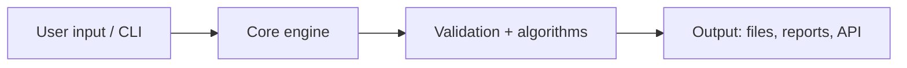

This page documents the software tool our team built to streamline a recurring
synthetic-biology workflow. We cover the problem it solves, its features and
architecture, and how anyone can install and run it.

> **Best Software Tool — Special Prize.** Describe software you developed that
> makes synthetic biology easier, faster, better, or more accessible. See the
> [Awards page](https://competition.igem.org/judging/awards) for details.

## The problem

Describe the specific pain point you observed in your own [wet lab](/wet-lab) or
in the wider community. Ground it in concrete evidence:

- What manual, error-prone, or slow step does the tool replace?
- Who experiences this problem (your team, other iGEM teams, educators)?
- Why do existing tools fall short for this use case?

State the problem in one sentence a non-specialist can understand, then expand
with the data or interviews from [Human Practices](/human-practices) that
motivated the build.

## Features

List the capabilities your tool delivers. Keep each item user-facing and
verifiable.

| Feature            | What it does         | Who benefits |
| ------------------ | -------------------- | ------------ |
| Describe feature 1 | Describe the outcome | Target user  |
| Describe feature 2 | Describe the outcome | Target user  |
| Describe feature 3 | Describe the outcome | Target user  |

## Architecture

Explain how the system is structured so others can extend it. The example below
shows a typical layering; replace it with your real components.



- **Language and stack.** State the language(s), key libraries, and runtime.
- **Modules.** List the main modules and their responsibilities.
- **Data flow.** Describe inputs, intermediate state, and outputs.

## How to run it

Follow these steps to get started:

1. Clone the repository and enter the directory.
2. Install dependencies in a virtual environment.
3. Run the tool against the bundled example input.

```bash
git clone https://github.com/your-org/your-tool.git
cd your-tool
python -m venv .venv && source .venv/bin/activate
pip install -e .
your-tool run --input examples/sample.fasta --out results/
```

Document expected output and any configuration flags so results are
reproducible. See [Results](/results) for benchmarks generated with this tool.

## License and repository

- **License.** Released under the MIT License (an OSI-approved open-source
  license); update this if you choose another such as Apache-2.0 or GPL-3.0.
- **Repository.** Source, issues, and contribution guidelines live at
  `https://github.com/your-org/your-tool` (replace with your real URL).
- **Reuse.** Note how other teams may install, cite, and adapt the tool.

## References

Cite the libraries, datasets, algorithms, and papers your software builds on.
Use a consistent citation style, link to each external source with a full
`https://` URL, and credit any code you adapted from other iGEM teams.
