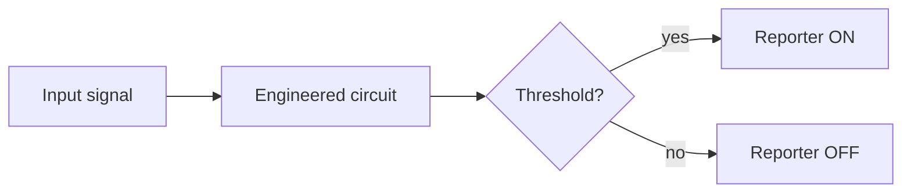
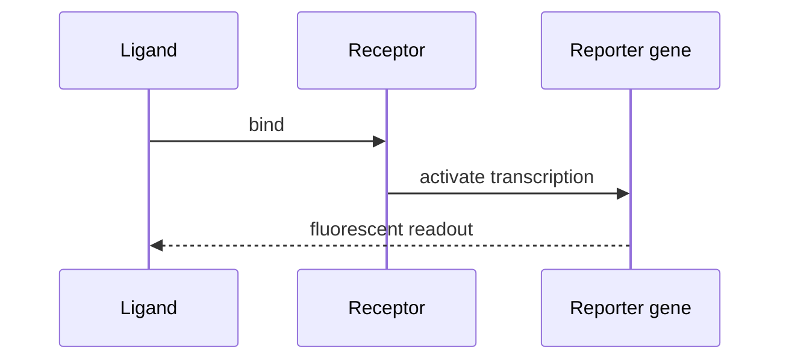

This page is a living demonstration of every Markdown feature the wiki renderer
supports. Use it as an authoring reference: anything shown below renders the same
way on any article page, because all pages share one rendering pipeline.

The renderer enables "smart typography", so straight quotes become curly ones,
`--` becomes an en dash (pages 3--9), `---` becomes an em dash --- like this ---
and three dots fold into an ellipsis... Symbols such as (c), (tm) and (r) are
converted automatically. Headings below are collected into the table of contents
on the side, so this page also exercises the contents navigation.

## Text and inline formatting

You can write **bold text**, _italic text_, **_bold italic text_**, and
~~strikethrough~~. Technical terms read well as `inline code`, for example the
`processMarkdown()` entry point or an environment variable like `VITE_BASE_PATH`.

Links come in three forms. An **internal** link is rewritten under the
deployment base path automatically — see the [Team page](/team). An **external**
link is hardened with `target="_blank"` and `rel="noopener noreferrer"`, for
example the [iGEM competition](https://igem.org). A bare URL is auto-linked too:
https://2026.igem.wiki/basis-china.

## Lists

Unordered lists nest cleanly:

- Wet lab
  - Strain construction
  - Characterisation
    - Plate reader assays
    - Flow cytometry
- Dry lab
  - Modelling
  - Software tooling

Ordered lists keep their numbering, and the two kinds can mix:

1. Define the design goal.
2. Build the genetic circuit.
   - Choose a chassis.
   - Assemble the parts.
3. Measure, then iterate.

## Callouts and blockquotes

Blockquotes double as callouts. The wiki convention is a bold lead-in label:

> **Note.** This is the standard callout style used across the wiki for medal
> criteria, safety reminders, and key takeaways.

Quotes can nest, and may contain other formatting:

> "Engineering biology is about making the unpredictable _measurable_."
>
> > A nested quote, attributed to the team's first design review.

## Tables

Pipe tables support per-column alignment — left, centre, and right:

| Part      |         Function          | Length (bp) |
| :-------- | :-----------------------: | ----------: |
| BBa_R0010 | LacI-repressible promoter |         200 |
| BBa_B0034 |   Ribosome binding site   |          12 |
| BBa_E0040 |       GFP reporter        |         720 |
| BBa_B0015 |     Double terminator     |         129 |

## Code blocks

Fenced code blocks are syntax-highlighted on the client (Prism) and get an
automatic "Copy" button. The renderer ships grammars for several languages.

```python
def hill_activation(ligand, k_d, n):
    """Fractional occupancy under cooperative binding."""
    return ligand**n / (k_d**n + ligand**n)


print(hill_activation(ligand=2.0, k_d=1.0, n=2))
```

```typescript
import { processMarkdown } from "@/features/content/markdownService";

export function renderArticle(raw: string): string {
  const { html, toc } = processMarkdown(raw);
  return `${toc.length} sections · ${html.length} bytes`;
}
```

```bash
bun run validate:pages && bun run type-check
bun run build
```

```sql
SELECT part_id, name, length_bp
FROM registry_parts
WHERE chassis = 'E. coli'
ORDER BY length_bp DESC
LIMIT 5;
```

```json
{
  "part": "BBa_E0040",
  "type": "reporter",
  "excitation_nm": 488,
  "emission_nm": 509
}
```

```yaml
strain: DH5-alpha
plasmid: pSB1C3
antibiotic: chloramphenicol
induction:
  inducer: IPTG
  concentration_mM: 1.0
```

## Math

Inline math sits in running text: the Michaelis constant $K_m$ is the substrate
concentration $[S]$ at which the rate is half of $V_{max}$. Display equations are
centred on their own line and rendered at build time, so they appear without any
client JavaScript:

$$
v = \frac{V_{max}\,[S]}{K_m + [S]}
\qquad\Longrightarrow\qquad
\theta = \frac{[L]^{\,n}}{K_d^{\,n} + [L]^{\,n}}
$$

## Diagrams

Fenced `mermaid` blocks are rendered to SVG on the client. A flowchart:



And a sequence diagram:



## Figures

Images are referenced with root-relative paths and rewritten under the base path
automatically:


## Headings and rules

Body headings render at three visible levels (the page title above owns the only
`<h1>`); levels two and three feed the table of contents. In source they look
like this:

```markdown
## Section (h2 — appears in the contents)

### Subsection (h3 — nested in the contents)

#### Detail (h4 — styled, not in the contents)
```

A horizontal rule separates major blocks:

---

That rule was written as three dashes on their own line.

## Structured software validation authoring example

Software claims should link a stated capability to reproducible tests, input conditions, outputs, and known limitations. The public wiki and its evidence trail should remain understandable, findable, and properly referenced [@igem-special-awards-2026].[^dry-lab-software-fixture]

The statement below links directly to the structured record: [[evidence:software-validation-demo|Open this authoring example]].

```result
id: software-validation-demo
title: Software validation result example
claim: This fixture demonstrates how a software capability can be linked to test evidence.
method: Deterministic build and validation script
controls:
  - Known-good fixture
  - Invalid-input fixture
replicates:
  technical: 3
result:
  value: Validation completed
  unit: authoring fixture
uncertainty: Runtime performance is not measured by this fixture
limitations:
  - Replace with real test coverage and user evaluation
citations:
  - igem-team-wiki-2026
```

### How this participates in long-form navigation

This heading and the section above enter the table of contents, receive stable permanent links, and update the active-section marker while the reader scrolls. The related-page links in frontmatter connect this example to adjacent evidence routes.

## Still intentionally unsupported

Raw HTML, task-list widgets, definition lists, and emoji shortcodes remain disabled. Add behavior through a reviewed Markdown rule or structured research block rather than pasting executable HTML.

[^dry-lab-software-fixture]: This is an authoring fixture, not project evidence. Replace it with verified BASIS-China records, real citations, and measured data before judging.
