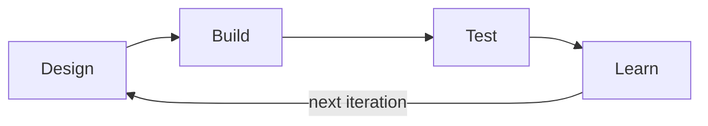

This page documents how our team demonstrated engineering success by completing
at least one full Design-Build-Test-Learn (DBTL) iteration on a technical
component of our project, then using what we learned to inform the next cycle.

> **Silver Medal Criterion — Engineering Success.** Demonstrate engineering
> success in a part of your project by going through at least one iteration of
> the engineering design cycle. See the
> [Medals page](https://competition.igem.org/judging/medals) for details.

## What we engineered

Briefly state the specific subsystem this page focuses on (for example, a
promoter-RBS combination, a sensor circuit, a purification protocol, or a piece
of hardware). Keep the scope narrow enough that one full DBTL loop is clearly
visible. For broader context, link to the [Project Description](/description)
and [Design](/design) pages.

## The DBTL cycle

We followed the iGEM engineering design cycle. The diagram below renders from a
Mermaid code block:

## Iteration 1, phase by phase

### Design

- State the hypothesis or specification you set out to meet.
- List the parts, sequences, or components chosen and why.
- Note constraints (cost, time, lab safety, available equipment).

### Build

- Describe how the construct or prototype was assembled (assembly method,
  chassis, key reagents).
- Record what actually got built versus what was planned.

### Test

- Define the measurable success criteria set before testing.
- Describe the assay, controls, and replicates. Summarize results below and
  link full datasets on the [Results](/results) page.

| Metric            | Target       | Observed       | Met?     |
| ----------------- | ------------ | -------------- | -------- |
| Describe metric 1 | Target value | Observed value | Yes / No |
| Describe metric 2 | Target value | Observed value | Yes / No |

### Learn

- State what the data told you, including failures, which are valuable.
- Explain the root cause of any gap between target and observation.
- List the concrete changes this drove for the next iteration.

## How learning fed the next iteration

Summarize, in order, how the insights above shaped Iteration 2:

1. State the single most important change made.
2. State the secondary adjustment and its rationale.
3. State the new success criterion you will test next.

This closes the loop and shows the cycle is genuinely iterative rather than a
one-off experiment. For ethical and safety considerations that informed these
choices, see [Human Practices](/human-practices) and the
[Safety](https://competition.igem.org/safety/about) guidelines.

## References

Cite all protocols, parts (with registry identifiers), datasets, and literature
that informed each DBTL phase. Use a consistent citation style and keep this
dedicated references section at the end of the page.
